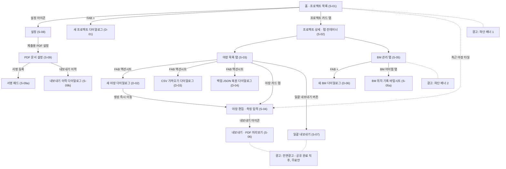

# 레벨 야장 (Lv Book) — 화면·기능 디자인 명세서

> 외부 디자인 팀 의뢰용 브리프 · 이 문서 하나로 와이어프레임·세부 UI 작업을 시작할 수 있도록 작성되었습니다.

---

## 1. 문서 안내 + 제품 개요

### 1.1 이 문서의 목적
이 문서는 **레벨 야장(Lv Book)** 앱의 전면 UI 리디자인을 외부 디자인 팀에 의뢰하기 위한 명세서입니다. 현재 앱은 기능이 모두 구현·검증된 상태이며, 이 문서는 **무엇이 화면에 있고(정보 구조·데이터·문구), 무엇이 재량이고(비주얼), 무엇을 지켜야 하는가(공통 규칙)**를 정리합니다. 코드에서 확인된 사실만 담았으며, 근거가 없는 부분은 "코드 근거 없음 — 디자이너 제안 영역"으로 표기했습니다.

### 1.2 제품 개요
- **앱**: 레벨 야장(Lv Book) — 토목·건축 현장의 직접수준측량 야장을 오프라인으로 기록하고, IH(기계고)/GH(지반고)/폐합오차를 자동 계산해 제출용 PDF/CSV로 만드는 모바일 앱. Flutter 기반, v1.1.0, Android 우선(iOS 지원).
- **타겟 유저**: 현장 측량 담당자·현장대리인. 야외(햇빛·장갑·한 손 조작) 환경에서 숫자를 빠르게 입력하고, 사무실에서 감리·발주처 제출 문서를 뽑는 상황.
- **시각적 주인공**: 측정 표의 **자동 계산 결과(IH·GH)와 검산 판정(적합/확인 필요)**. 모든 화면에서 "지금 이 측량이 맞는가"가 가장 먼저 읽혀야 합니다.
- **플랫폼·제약**: 모바일 세로 화면 기준(기준 뷰포트 360×800), 라이트/다크 모두 지원(시스템 추종), 한국어 단일 언어, 오프라인 퍼스트(로그인 없음).
- **수익 모델**: 무료 + 광고(하단 배너 2곳, 내보내기 후 전면광고) + Pro 일회성 구매(광고 제거·BM 사진/좌표·일괄 내보내기·요약 보고서). **별도 페이월 화면 없음** — 설정 화면 상단 패널이 페이월 역할을 하고, 홈 상단에도 Pro 진입 패널이 있습니다.

### 1.3 핵심 원칙 박스

> ✅ **구현됨 화면**은 IA(정보 구조)·데이터·문구가 **확정**이며, 비주얼(레이아웃 디테일, 컬러 활용, 컴포넌트 스타일)은 **전면 재량**입니다.
>
> 단, **3장의 공통 규칙은 예외**입니다. 데이터 표기(4.1), 시맨틱 컬러 의미론(4.2), 기능 정합성 문구(4.3), 금지 표현(4.4)은 임의 변경하지 마세요. 색상 값·폰트·레이아웃은 바꿔도 되지만, 의미와 원문은 유지합니다.

---

## 2. 기능 현황 총괄표

| 상태 | 기능 |
|---|---|
| ✅ 구현됨 | 프로젝트 관리 |
| ✅ 구현됨 | BM/TBM 관리 (상태·재확인 경고·Pro 사진/좌표) |
| ✅ 구현됨 | 야장 작성 (스프레드시트 입력, IH/GH/TP 자동 계산, 5종 검증, 900ms 자동저장) |
| ✅ 구현됨 | 검토 상태 워크플로 (작성중/검토완료/확인필요) |
| ✅ 구현됨 | 단일 PDF/CSV 내보내기 + 미리보기 |
| ✅ 구현됨 | 일괄 내보내기 + 제출 패키지 (Pro) |
| ✅ 구현됨 | PDF 문서 설정 (프리셋·워터마크·서명란·손글씨 서명 — **무료 개방**) |
| ✅ 구현됨 | CSV 가져오기 |
| ✅ 구현됨 | 백업 (자동/수동 공유/JSON 복원) |
| ✅ 구현됨 | 광고 (배너 2곳 + 전면) |
| ✅ 구현됨 | Pro 일시구매·복원 |
| ✅ 구현됨 | 라이트/다크 테마 (시스템 추종) |
| 🔜 다음 버전 | **네이티브 광고**를 프로젝트/야장 목록에 낮은 빈도로 삽입 — 리스트에 광고 카드 슬롯 디자인 필요 (기획 문서 Phase 6A 미완 항목) |
| 📦 이후 (로드맵 후보) | 기기 간 데이터 동기화 / 클라우드 백업 |
| 📦 이후 (로드맵 후보) | 내보내기 이력 전용 화면 (현재는 PDF 설정 화면 안의 다이얼로그) |
| 📦 이후 (로드맵 후보) | 허용오차 커스터마이징 |

> 📦 항목은 기획·FAQ에서 언급된 미구현 기능으로 **확정이 아니며**, 이번 의뢰 범위에서 제외됩니다(7장 참조).

---

## 3. 전체 유저 플로우 다이어그램

**광고 노출 지점 (다이어그램 주석)**
- **배너 광고 1**: 홈(프로젝트 목록) 하단 앵커드 적응형 배너.
- **배너 광고 2**: BM 관리 탭 하단 앵커드 적응형 배너.
- **전면광고 1지점**: 내보내기(단일) 및 일괄 내보내기의 **공유 완료 직후** 노출. 하루 최대 3회, 최소 10분 간격. Pro 사용자에게는 배너·전면 모두 노출되지 않음.

---

## 4. 공통 규칙 (디자이너 임의 변경 금지)

> 이 장의 규칙은 화면별 명세(5장)에서 반복하지 않고 참조합니다. 색상 **값**과 레이아웃은 재량이지만, **의미·표기·원문**은 유지하세요.

### 4.1 데이터 표기 규칙

| 항목 | 규칙 |
|---|---|
| 단위 | 전부 **m(미터)**. mm 미사용 |
| 표고 · IH · GH · ΣBS · ΣFS · 차 | 소수 **3자리** |
| 폐합오차(오차) | 소수 **4자리** (유일하게 4자리) |
| 허용오차 | **0.001 m (= 1 mm)** |
| BS · FS (입력값) | 입력값 그대로 표시 (자릿수 강제 없음) |
| 날짜 | `yyyy-MM-dd` |
| 시각 | `yyyy-MM-dd HH:mm` |
| 좌표 (위도/경도) | 소수 **6자리** |
| 단위 조사 | 야장 **권** / 확인 필요 **건** / 현장·BM **개** / 경과 **일** |
| 판정 라벨 | **'적합'** / **'확인 필요'** — 두 가지뿐 (합격/불합격 등 금지) |
| 검토 상태 | **'작성중'** / **'검토완료'** / **'확인필요'** — 3종 |
| BM 상태 | **'사용 가능'** / **'훼손 의심'** / **'사용 중지'** — 3종 |
| BM 종류 | **'BM'** / **'TBM'** — 2종 |
| 문서 템플릿 | **'기본 야장'** / **'제출용'** / **'검측용'** — 3종 |
| 파일명 규칙 | **'야장명'** / **'현장_날짜_야장명'** / **'현장_작업구간_날짜_야장명'** — 3종 |

### 4.2 시맨틱 컬러 의미론
색상 **값은 바꿔도 되지만 의미 매핑은 유지**합니다.

| 색 계열 | 의미 |
|---|---|
| **초록 계열** | GH(지반고) · 적합 판정 · 사용 가능 상태 |
| **파랑 계열** | IH(기계고) · 기준점(BM) |
| **오렌지 계열** | TP(이기점) · 주의 · Pro/백업 강조 |
| **error(빨강) 계열** | 차단 오류 · 사용 중지 |

> ⚠️ **IH와 GH는 반드시 서로 다른 색으로 구분**하세요. 현장에서 열을 색으로 식별합니다.

### 4.3 법적·정책 문구 (원문 유지)
규제상 필수 문구는 없습니다. 다만 다음은 **기능 정합성** 때문에 원문을 유지합니다.
- **광고 정책 안내 2문구** (설정 화면): "화면 폭에 맞는 적응형 배너를 하단에 표시합니다." / "공유 완료 후 최대 하루 3회, 10분 간격으로만 표시합니다."
- **삭제 다이얼로그 연쇄 삭제 경고**: "관련된 모든 야장과 BM도 삭제됩니다."
- **BM 재확인 경고 4문구** (9장 별첨 B 참조): 사용 중지 / 훼손 의심 / 최종 확인일 없음 / 30일 경과.
- **위치 권한 안내 문구**: OS 정책상 의미 왜곡 금지 (표현 다듬기는 가능하나 의미 유지).

### 4.4 금지·주의 표현
- **'불합격' 표현 금지** — 공식 판정은 '확인 필요'입니다.
- 허용오차 초과를 **"오류"로 단정하는 카피 금지** — 내보내기는 가능하며 **경고**일 뿐입니다.
- **Pro를 '구독'으로 표기 금지** — 일회성 구매입니다.

### 4.5 전 화면 공통 상태

**현재 구현 상태**
| 상태 | 현재 구현 |
|---|---|
| 로딩 | 중앙 스피너 |
| 오류 | `'오류: $e'` 원시 텍스트 |
| 빈 상태 | EmptyState 위젯 (아이콘 배지 + 제목 + 설명) |

**디자인 필요 항목 (신규)**
- **로딩 스켈레톤 세트**: 리스트 / 표 / PDF 미리보기 3종.
- **오류 상태**: 일러스트 + 재시도 버튼 (현재 원시 텍스트라 신규 디자인 필수).
- **빈 상태 일러스트 6종**: 프로젝트 / 야장 / BM / 검색 결과 / 내보내기 이력 / 서명.
- **스낵바 스타일**: 성공 / 실패 / 진행 3종.

### 4.6 광고 영역 규칙
- 배너는 **하단 앵커드 적응형**(홈 · BM 목록 2곳). 화면 폭에 맞춰 높이가 결정됩니다.
- **Pro 사용자·미지원 플랫폼·로딩 중에는 영역 자체가 사라짐**(높이 0). → 배너 유무 **양쪽 레이아웃 모두** 디자인하세요.
- 리스트 하단 여백 **96** 확보 관행 (FAB·배너 회피).

---

## 5. 화면별 명세

> 각 화면은 6개 항목으로 기술합니다: **목적 / 구성 요소(위→아래) / 데이터 표시 규칙 / 인터랙션 / 예정 추가 요소 / 디자인 유의점**. 문구는 코드 원문을 인용합니다. 공통 규칙(4장)은 참조만 합니다.
> 아이콘은 "Material Icons 기준 현재 사용: settings" 식으로 참고 표기하며, **교체는 재량**입니다.

---

### S-01 홈 (프로젝트 목록) ✅

**목적** — 3초 안에 답할 질문: *"내 현장들이 어떤 상태이고, 뭘 이어서 하면 되나?"*

**구성 요소 (위→아래)**
1. **AppBar**: 타이틀 '레벨 야장', 우측 설정 아이콘(현재: `settings`, tooltip '설정') → 설정 화면.
2. **Pro 진입 패널** (항상 최상단 고정):
   - 좌측 36×36 아이콘 배지 (현재: 미구매 `workspace_premium` / 구매 `verified`, 오렌지).
   - 제목: 미구매 '레벨 야장 Pro' / 구매 'Pro 활성화됨'.
   - 부제: 미구매 'TBM/BM 사진 좌표, 제출용 PDF, 광고 제거를 잠금 해제하세요.' / 구매 'TBM/BM 사진 좌표, 광고 제거, 제출용 PDF를 사용할 수 있습니다.'
   - 우측 버튼(미구매만): 'Pro 신청' → 설정 화면.
3. **리스트 영역** (로딩=중앙 스피너 / 오류='오류: $e' / 데이터=아래 리스트):
   - (조건부) **백업 리마인더 배너**: 아이콘 `backup_outlined`(오렌지), 오렌지 테두리. 제목 '아직 백업을 공유한 적이 없어요' 또는 '마지막 백업 공유가 N일 전이에요'. 본문 '기기 분실·앱 삭제 시 현장 기록이 사라집니다. 백업 파일을 메일이나 드라이브에 보관하세요.' 버튼 '나중에'(7일 스누즈) / '백업 공유'(현재: `ios_share`).
   - **프로젝트 요약 카드**: 42×42 아이콘 `map_outlined`(초록). 제목 '현장 N개 관리 중'. 부제 '야장 N권' + (' · 확인 필요 N건' 또는 ' · 모두 검토 완료').
   - (조건부) **최근 야장 타일**: 42×42 `edit_note_outlined`(오렌지). 제목=최근 야장 제목(1줄 ellipsis), 부제 '최근 작업 · {프로젝트명} · yyyy-MM-dd', 우측 chevron → 해당 야장 편집 화면.
   - **프로젝트 카드** (반복): 42×42 `business_outlined`(초록). 제목=현장명(1줄 ellipsis). 부제=설명(있을 때만) / '최근 업데이트 · yyyy-MM-dd' / (야장 있으면) '야장 N권' + (확인 필요 있으면) ' · 확인 필요 N건'. 우측 PopupMenu '수정'/'삭제'.
4. **배너 광고** — 화면 최하단 고정 (배너 1).
5. **FAB** (현재: `add`) → 새 프로젝트 다이얼로그.

**데이터 표시 규칙** — 날짜 `yyyy-MM-dd`. 단위 조사: 야장 '권' / 확인 필요 '건' / 현장 '개' / 경과 '일' (4.1).

**인터랙션** — 프로젝트 카드 탭 → 프로젝트 상세. 최근 야장 타일 탭 → 야장 편집으로 바로 진입. 백업 배너 '나중에' → 7일 스누즈.

**예정 추가 요소** — 🔜 네이티브 광고 카드를 프로젝트 리스트에 낮은 빈도로 삽입(광고 카드 슬롯 디자인 필요, 7장).

**디자인 유의점**
- **빈 상태**: 아이콘 `construction` / '첫 현장을 추가하세요' / '+ 버튼으로 프로젝트를 만들고 야장/BM을 기록합니다.'
- Pro 진입 패널은 현재 **정적 상수 색**(다크모드에서도 동일한 어두운 카드)으로 그려집니다 — 다크모드 대응 재검토 대상.
- 배너 유무 양쪽 레이아웃 모두 디자인(4.6).

---

### S-02 프로젝트 상세 (탭 컨테이너) ✅

**목적** — 3초 질문: *"이 현장에 야장이 몇 권 있고, BM은 관리되고 있나?"*

**구성 요소 (위→아래)**
1. **AppBar**: 타이틀=프로젝트명.
2. **TabBar** 2탭 (아이콘+텍스트): `description_outlined` '야장' (→ S-03) / `pin_drop_outlined` 'BM 관리' (→ S-05).
3. 본문=선택된 탭 화면.

**데이터 표시 규칙** — 없음(하위 화면이 담당).

**인터랙션** — 탭 전환. 자체 FAB/빈 상태 없음(하위 화면이 담당).

**예정 추가 요소** — 없음.

**디자인 유의점** — 탭 인디케이터는 오렌지 컨벤션. 순수 컨테이너이므로 탭바 자체의 시인성·터치 영역이 관건.

---

### S-03 야장 목록 ✅

**목적** — 3초 질문: *"어떤 야장이 있고, 어느 게 확인이 필요한가? 새로 하나 만들거나 이어서 열려면?"*

**구성 요소 (위→아래)**
1. **검색 필드**: 돋보기 prefix, label '야장 검색', hint '제목, 작업구간, 측량자, 날짜' — 실시간 필터.
2. **전체폭 버튼**: `folder_copy_outlined` '일괄 내보내기' → S-07.
3. **리스트** (하단 패딩 96). 검색 결과 없으면 중앙 '검색 결과가 없습니다'.
   - **야장 카드** (Card+ListTile): Leading 42×42 라운드8 파랑 10% 배경 `description_outlined`(파랑). Title=야장 제목(1줄 ellipsis). Subtitle 1줄 '{yyyy-MM-dd} · {작업구간} · 측량자 {이름}'(있는 항목만 ' · ' 조인). Trailing PopupMenu '구조 복제'/'삭제'.
4. **FAB** (extended, `add` + 라벨 '야장') → 액션 바텀시트.

**데이터 표시 규칙** — 날짜 `yyyy-MM-dd` (4.1).

**인터랙션**
- 야장 카드 탭 → 야장 편집(S-04).
- FAB → 액션 바텀시트 (ListTile 4개): `note_add_outlined` '새 야장' / `upload_file_outlined` 'CSV 가져오기' / `backup_outlined` '프로젝트 백업 공유' / `restore_page_outlined` '백업 JSON 복원'.
- '구조 복제' → 스낵바 '야장 구조를 복제했습니다' (측점명·유형만 복사, 관측값 비움, 제목 '{원제목} 복사').

**예정 추가 요소** — 🔜 네이티브 광고 카드 슬롯(리스트 삽입 후보).

**디자인 유의점**
- **빈 상태**: `menu_book_outlined`, 오렌지 accent, '첫 야장을 만들어 보세요' / '+ 버튼으로 새 야장을 만들거나\nCSV 가져오기로 기존 기록을 불러올 수 있습니다.'
- 파랑 배지(야장)는 BM의 텍스트 배지와 시각적으로 구분되어야 함.

---

### S-04 야장 편집 (측정 입력) ✅ ⭐ 최우선 화면

**목적** — 3초 질문: *"이 측량은 지금 맞게 가고 있나(검산·판정), 다음 입력은 어디인가?"* 이 화면이 앱의 핵심 가치이며 사용 시간의 대부분을 차지합니다.

**구성 요소 (위→아래)**
1. **AppBar**: 제목=야장 제목. 액션 3개: `add` '10행 추가' / `save` '저장'(스낵바 '저장 완료') / `ios_share` '내보내기'.
2. **시작 표고 바**: 어두운 배경(잉크색). `straighten` 아이콘 + '시작 표고'(13px) + 폭 100 입력 필드(소수3, 볼드, 중앙, 숫자키보드) + 'm'.
3. **검토 정보 패널** (ExpansionTile): `fact_check_outlined` '검토 정보', subtitle '{상태라벨} · 검토일 yyyy-MM-dd'.
   - 펼침: 드롭다운 '검토 상태'(작성중/검토완료/확인필요) / '검토 메모' hint '예: 감리 확인 완료' / 버튼 '오늘 검토일 적용' 또는 '검토일 yyyy-MM-dd' / '검토 정보 저장'(스낵바 '검토 정보를 저장했습니다').
4. **표 헤더** (높이 36, 볼드 13, 중앙, 열 비율): NO(1) | BS(2) | FS(2) | IH(2) | GH(2) | 액션(1).
5. **측정 표 본문** (Expanded, 행높이 42 고정, 초기 20행) — 아래 '측정 표 행' 참조.
6. **검증 바** — 아래 참조.
7. **합계 요약** — 아래 참조.

**측정 표 행**
- **배경**: TP 행 오렌지 10% / 데이터 행 짝수 panel·홀수 zebra / 빈 행 짝수 panel·홀수 paper. 하단 0.5px 구분선.
- **NO 셀**: 탭 → 측점명 편집 다이얼로그. 이름 없으면 행번호(placeholder색), 있으면 초록 w600.
- **BS/FS 셀**: 인라인 TextField, 14px 우측정렬, 테두리 없음. 숫자 키보드(소수·부호 허용). 입력 확정 시 BS→같은 행 FS→다음 행 BS 순으로 포커스 이동 + 자동 스크롤.
- **IH 셀**: 읽기전용, 우측정렬 소수3, **파랑** 14px.
- **GH 셀**: 읽기전용, 우측정렬 소수3, **초록** 14px w600.
- **액션 셀**: TP면 `flag`(오렌지 18px), 아니면 `more_vert`. tooltip '행 작업'. 메뉴: '아래 행 삽입'/'행 복제'/'수동 TP 지정'↔'수동 TP 해제'/'삭제'.
- **행 삭제**: 롱프레스 또는 메뉴. 데이터 있으면 확인 다이얼로그 '행 삭제'/'{n}번 행을 삭제하시겠습니까?', 빈 행은 즉시 삭제.
- **측점명 편집 다이얼로그**: '측점명 수정', label '측점명', hint '예: No.1, BM.1, TP.1', helper '비우면 행 번호({n})로 표시됩니다'.

**자동 저장**
- 입력 후 **900ms 디바운스** 자동저장. 상태 문자열: '저장됨' → '자동저장 대기' → '자동저장됨' (수동 저장 시 '저장됨').
- 화면 이탈(뒤로가기) 시에도 자동 저장. 저장 중 검증 바 우측 14×14 스피너.

**검증 바**
- 통과: 초록 10% 배경 + `check_circle_outline`, 텍스트 '검산 적합 · {저장상태}'.
- 실패: errorContainer 배경 + `error_outline`, '{첫 오류 메시지} · {저장상태}'.
- 아래 **체크 뱃지 Wrap**(11px w700): '✓ {라벨}'(초록) / '! {라벨}'(오류). 라벨 5종: 첫 BS / 마지막 FS / TP 완성 / 빈 행 / 허용오차.

**합계 요약** (chip 2행, 라벨 11px subtext + 값 13px 볼드)
- 1행: ΣBS(소수3) / ΣFS(소수3) / 차=ΣBS−ΣFS(소수3).
- 2행: 시작(첫 GH, 소수3 또는 '-') / 최종(마지막 GH) / 오차(폐합오차, 소수4).
- **오차 chip**: |오차|<0.001이면 초록, 아니면 error 색.

**데이터 표시 규칙** — 4.1 전부 적용. IH·GH·표고·ΣBS·ΣFS·차 소수3, 오차만 소수4. BS/FS는 입력값 그대로. 허용오차 0.001m.

**인터랙션 — 내보내기 전 검증**
- 차단 오류 있으면: 다이얼로그 '내보내기 전 확인'(본문=오류 나열, '확인'만) → 진행 불가.
- 허용오차만 초과: 다이얼로그 '허용오차 확인 필요', '취소'/'계속'.
- 데이터 없음: 스낵바 '내보낼 데이터가 없습니다'.

**예정 추가 요소** — 없음(핵심 화면, 기능 완결).

**디자인 유의점 (현장 환경 최우선)**
- **터치 영역 44×44 이상** — 장갑 낀 손으로도 셀·액션 버튼을 정확히 누를 수 있어야 함. 인라인 셀 입력 필드와 액션 아이콘의 실제 히트 영역 확보.
- **고대비 · 햇빛 대응** — 야외 직사광 아래에서도 IH/GH 값과 검산 판정이 읽혀야 함. 판정 색은 색상만이 아니라 아이콘·텍스트 라벨과 병행(4.4 색+텍스트).
- **한 손 조작** — 자주 쓰는 액션(저장·10행 추가·내보내기)과 검산 결과는 엄지 도달 범위 고려.
- **IH·GH 열 색 구분 필수**(4.2) — 두 계산 결과 열을 색으로 즉시 식별.
- 다이내믹 폰트 스케일 1.3배까지 6열 표가 깨지지 않도록 설계(숫자 tabular numerals 권장).
- 스프레드시트 셀 상태 3종(입력 가능 / 읽기전용 IH·GH / TP 강조 행)이 명확히 구분되어야 함.

---

### S-05 BM 관리 ✅

**목적** — 3초 질문: *"이 현장의 기준점들이 지금 쓸 수 있는 상태인가?"*

**구성 요소 (위→아래)**
1. **리스트 영역** (로딩 스피너 / '오류: $e' / 리스트 또는 빈 상태, 패딩 8·8·8·96).
   - **BM 아이템** (Card+ListTile): Leading 42×42 라운드8 **텍스트 배지** 'BM' 또는 'TBM' (사용 가능=초록 10% 배경+초록 글자 / 사용 중지=errorContainer+error). Title=BM 이름(1줄). Subtitle 세로 나열: '표고 {소수3} m' / '종류: BM|TBM' / '상태: 사용 가능|훼손 의심|사용 중지'(중지는 error색) / (있으면)'위치: {힌트}' / (있으면) 설명 / (있으면)'보호: {메모}'. Trailing PopupMenu '수정'/'삭제'.
   - 목록에는 **사진·좌표 미표시** (탭 시 바텀시트에서만).
2. **배너 광고** — 하단 고정 (배너 2).
3. **FAB** (`add`) → 새 BM 다이얼로그.

**데이터 표시 규칙** — 표고 소수3 m. BM 상태 3종·종류 2종은 4.1 원문. 좌표는 바텀시트에서만.

**인터랙션**
- BM 아이템 탭 → 위치 기록 바텀시트(S-05a).
- 추가/수정 다이얼로그: '새 BM 추가'/'BM 수정'. 필드 순서: 'BM 이름 *'(hint '예: BM.1') / '표고 (m) *'(hint '예: 100.000', 숫자) / '설명 (선택)' / '현장 위치 힌트' / '보호/확인 메모' / 드롭다운 '상태' / 드롭다운 '종류'. 액션 '취소'/'추가'|'저장'.
- 삭제: 'BM 삭제' / '"{이름}" (표고: {값})을 삭제하시겠습니까?'.

**예정 추가 요소** — 없음.

**디자인 유의점**
- **빈 상태**: `flag_outlined`, 파랑 accent, 'BM(기준점)을 등록하세요' / '+ 버튼으로 표고 기준이 되는 BM/TBM을 추가하면\n야장 작성 시 시작 표고로 바로 불러올 수 있습니다.'
- ⚠️ **BM 폼 검증 실패 시 무반응** — 현재 이름·표고 검증에 실패하면 저장되지 않은 채 다이얼로그만 열려 있고 **오류 피드백이 전혀 없음**. 인라인 오류 표시 신규 디자인 필요.
- 상태 배지(사용 가능/훼손 의심/사용 중지)를 색+텍스트로 병행 표기.

---

### S-05a BM 위치 기록 바텀시트 ✅ (Pro / 비-Pro 2상태)

**목적** — 3초 질문: *"이 BM의 실제 위치와 사진·좌표가 있나? (Pro면 지금 기록/저장)"*

**구성 요소 (위→아래)**
- 드래그 핸들 + 헤더(종류 배지 + 이름) + 소제목 'Pro 위치 기록'.
- **비-Pro**: 안내 텍스트만 — 데이터 있으면 'Pro 위치 정보 저장됨', 없으면 'Pro에서 TBM/BM 사진과 좌표를 저장할 수 있습니다.'
- **Pro**:
  - 좌표 표시 (위도/경도 소수6 + '정확도 N m', 없으면 '저장된 좌표가 없습니다.').
  - 버튼 '현재 좌표 저장'(진행 중 '좌표 저장 중') / '좌표 복사' · '지도 열기'.
  - 사진 상태 ('사진 저장됨' / '저장된 사진이 없습니다.') / 사진 미리보기(높이 160) / '사진 촬영' · '사진 선택' / '사진 제거'.

**데이터 표시 규칙** — 좌표 소수6. 좌표 복사 형식 '위도 {소수6}, 경도 {소수6}'.

**인터랙션·오류 문구 (원문 유지, 4.3)** — '기기 위치 서비스가 꺼져 있습니다.' / '위치 권한이 거부되었습니다.' / '위치 권한이 영구적으로 거부되었습니다. 앱 설정에서 권한을 허용하세요.' / '지도 앱을 열 수 없습니다. 좌표를 복사해 사용하세요.' / '레벨 야장 Pro 구매 후 사용할 수 있습니다.'

**예정 추가 요소** — 없음.

**디자인 유의점** — Pro/비-Pro 두 상태를 모두 디자인. 비-Pro는 잠금 상태의 업셀 톤(4.4 '구독' 금지). 위치 권한 안내 문구는 의미 왜곡 금지.

---

### S-06 내보내기 (PDF 미리보기) ✅

**목적** — 3초 질문: *"제출할 문서가 어떻게 나오는가, 지금 공유하면 되나?"*

**구성 요소 (위→아래)**
1. **AppBar**: '내보내기'. 액션: `picture_as_pdf` tooltip 'PDF 공유' / `table_chart` tooltip 'CSV 공유'.
2. **본문** = PDF 실시간 미리보기. 용지/방향 변경 불가, 인쇄/공유 허용.

**데이터 표시 규칙** — 저장된 PDF 문서 설정 자동 적용(무료 포함). 출력물 규칙은 P-01 참조.

**인터랙션**
- 무료 사용자는 공유 완료 직후 전면광고(하루 3회, 10분 간격).
- 오류: 'PDF 생성 실패: $e' / 'CSV 생성 실패: $e'.

**예정 추가 요소** — 📦 내보내기 이력 전용 화면(현재는 PDF 설정 화면 안 다이얼로그, S-09b) — 이번 범위 제외.

**디자인 유의점**
- 미리보기 로딩 스켈레톤 필요(4.5).
- 내보내기 이력은 이 화면에 표시 UI가 없음(백그라운드 기록, 최근 30건).

---

### S-07 일괄 내보내기 ✅ (Pro 게이팅 2상태)

**목적** — 3초 질문: *"여러 야장을 한 번에 어떤 형식으로 묶어 내보낼까?"*

**구성 요소 (위→아래)**
1. **AppBar**: '일괄 내보내기', 우측 TextButton '전체'/'해제'.
2. (비-Pro) **잠금 배너**: `lock_outline` 'Pro 전용 기능' / '여러 야장을 한 번에 PDF/CSV로 공유할 수 있습니다.'
3. **SegmentedButton 3분절**: PDF / CSV / '둘 다'.
4. **체크박스 2개** (비-Pro 비활성): '제출 패키지 manifest 포함'('선택한 야장, 생성 파일, 측점 수를 함께 정리합니다.') / '검측/제출 요약 CSV 포함'('야장별 BM, 작업구간, 오차, 판정을 한 파일로 묶습니다.').
5. **야장 CheckboxListTile 목록** (제목/날짜, 기본 전체 선택).
6. **하단 고정 전체폭 버튼**: `ios_share` '{N}개 야장 공유' (Pro + 선택 1개 이상일 때만 활성).

**데이터 표시 규칙** — 목록 날짜 `yyyy-MM-dd`.

**인터랙션** — 결과 스낵바: '내보낼 데이터가 있는 야장이 없습니다' / '{N}개 파일을 공유했습니다' / '일괄 내보내기 실패: $error'. 무료 사용자 공유 후 전면광고.

**예정 추가 요소** — 없음.

**디자인 유의점** — Pro 게이팅 2상태(잠금/해제) 모두 디자인. 비활성 컨트롤(비-Pro의 체크박스·SegmentedButton)의 '왜 잠겼는지'가 읽혀야 함. Pro는 '구독' 아님(4.4).

---

### S-08 설정 ✅ (Pro 패널 = 페이월, 구매 전/후 2상태)

**목적** — 3초 질문: *"Pro가 뭘 주고, 지금 내 구매·광고 상태는 어떤가, 문서 설정은 어디서 하나?"*

**구성 요소 (위→아래)** — AppBar '설정'. ListView:
1. **(A) Pro 구매 패널** (최상단 강조 카드 = 사실상 페이월):
   - 다크(잉크) 배경 + 오렌지 테두리 (라이트/다크 동일 — 유의점 참조).
   - 42×42 오렌지 아이콘 박스 (Pro=`verified` / 미구매=`workspace_premium`).
   - 제목: 'Pro 활성화됨' / '레벨 야장 Pro'.
   - 설명: Pro='광고 없이 제출용 문서를 만들 수 있습니다.' / 미구매(가격 미로드)='일회성 구매로 현장 기록 Pro 기능을 잠금 해제합니다.' / 미구매(가격 로드)='{가격} · 일회성 구매'.
   - 기능 배지 4개(Wrap): '광고 제거' / 'TBM/BM 사진 좌표' / '일괄 내보내기' / '요약 보고서'.
   - 미구매 시 전체폭 버튼: `shopping_bag_outlined` '레벨 야장 Pro 구매' (처리 중 '처리 중'+스피너).
2. **(B) 섹션 '구매 상태'**:
   - '광고 제거' — **읽기 전용** SwitchListTile (조작 불가, 상태 표시 전용). subtitle: 구매 '구매 상태가 적용되어 광고가 표시되지 않습니다.' / 미구매 '스토어 상품 연결 후 일시구매로 모든 광고를 제거합니다.' 로딩/에러 상태 문구 있음.
   - '구매 복원' — ListTile(`restore`), subtitle '이미 구매한 Pro 권한을 복원합니다.'
3. **(C) 섹션 '문서 설정'**:
   - '제출용 PDF 설정' — ListTile(`picture_as_pdf_outlined`, chevron), subtitle '회사명, 템플릿, 워터마크, 서명을 설정합니다.' → S-09.
4. **(D) 섹션 '광고 노출 정책'** (읽기 전용 정보 타일 2개):
   - '배너 광고' — '화면 폭에 맞는 적응형 배너를 하단에 표시합니다.'
   - '내보내기 광고' — '공유 완료 후 최대 하루 3회, 10분 간격으로만 표시합니다.'

**데이터 표시 규칙** — 가격은 스토어 현지 통화 문자열(앱이 지정하지 않음).

**인터랙션** — 구매 결과 스낵바: '결제를 처리하는 중입니다.' / '레벨 야장 Pro가 활성화되었습니다.' / '결제가 실패했습니다.' / '결제가 취소되었습니다.' / '스토어 결제를 사용할 수 없습니다.'

**예정 추가 요소** — 없음.

**디자인 유의점**
- ⚠️ **'광고 제거' 스위치는 조작 불가한 상태 표시용** — 일반 토글 스위치와 **시각적으로 구분** 필요(사용자가 눌러도 바뀌지 않음).
- ⚠️ Pro 패널은 현재 **정적 상수 색**(라이트/다크 동일한 어두운 카드) — 다크모드 대응 재검토 대상.
- 광고 정책 2문구는 원문 유지(4.3).
- 페이월이 별도 화면이 아니므로, 이 패널의 업셀 설득력이 곧 전환율. Pro '구독' 표기 금지(4.4).

---

### S-09 PDF 문서 설정 ✅

**목적** — 3초 질문: *"제출 문서에 우리 회사·서명·워터마크가 어떻게 찍혀 나오나?"*
> 참고: AppBar 명칭은 'Pro PDF 설정'이지만 **전 기능 무료 개방**입니다.

**구성 요소 (위→아래)**
1. **'문서 프리셋'** 드롭다운 + 아이콘 버튼 3개('프리셋 추가'/'프리셋 이름 변경'/'프리셋 삭제'). 기본 프리셋: '기본 야장'/'제출용'/'검측용'.
2. **'회사명'** hint '예: 주식회사 레벨측량' (`business`).
3. **'작성자'** hint '예: 홍길동' (`person_outline`).
4. **'문서 템플릿'** 드롭다운: '기본 야장'/'제출용'/'검측용'.
5. **'파일명 규칙'** 드롭다운: '야장명' / '현장_날짜_야장명' / '현장_작업구간_날짜_야장명'.
6. **'워터마크'** hint '예: 검측용'.
7. **'하단 메모'** hint '예: 현장대리인 확인'.
8. **스위치 '검산 판정 표시'** (기본 ON) — 'PDF/CSV에 적합 또는 확인 필요 판정을 포함합니다.'
9. **스위치 '확인 서명란 표시'** (기본 ON) — '제출용 PDF 하단에 작성/검토/승인란을 추가합니다.'
10. **'작성자 서명' 카드** (위 스위치 ON일 때만): 설명 "PDF '작성'란에 들어갈 손글씨 서명을 등록합니다." / 미리보기(높이 80, 흰 배경; 미등록 '등록된 서명이 없습니다') / 버튼 '서명 등록'|'다시 서명' + (등록 시) '삭제'.
11. **'파일명 미리보기'** — 예시 데이터: 현장 '강남 현장', 야장 'A구간 야장', 날짜 2026-06-08, 구간 'STA.0+000'.
12. **버튼 '저장'** → 스낵바 'Pro PDF 설정을 저장했습니다'.
13. **버튼 '내보내기 이력'** → 다이얼로그(S-09b).

**데이터 표시 규칙** — 파일명 미리보기는 선택한 파일명 규칙에 따라 실시간 반영.

**인터랙션** — 프리셋 이름 다이얼로그: '프리셋 추가'|'프리셋 이름 변경', 필드 '프리셋 이름', 기본값 '새 프리셋'.

**예정 추가 요소** — 없음.

**디자인 유의점**
- 폼이 길다 — 섹션 그룹핑과 스크롤 시 저장 버튼 접근성 고려.
- 서명란 스위치 OFF 시 서명 카드(10번)가 사라지는 조건부 레이아웃.

---

### S-09a 서명 패드 다이얼로그 ✅

**목적** — 3초 질문: *"여기 손글씨로 서명하면 문서에 들어가나?"*

**구성 요소** — 제목 '서명 입력', 안내 '아래 영역에 손가락 또는 펜으로 서명하세요.' 캔버스 높이 200, 흰 배경, 검정 펜 굵기 3, 테두리. 액션: '다시 쓰기' / '취소' / '저장'.

**데이터 표시 규칙** — 서명은 PNG로 저장되어 PDF '작성'란에 삽입.

**인터랙션** — 바깥 탭으로 닫기 불가. 빈 저장 시 '서명을 입력해 주세요'.

**예정 추가 요소** — 없음.

**디자인 유의점** — 캔버스 필압/굵기 재량. 손가락·펜 모두 고려한 캔버스 크기. 빈 상태 일러스트 6종 중 '서명' 포함(4.5).

---

### S-09b 내보내기 이력 다이얼로그 ✅

**목적** — 3초 질문: *"방금·최근에 뭘 어떤 파일로 내보냈나?"*

**구성 요소** — 제목 '내보내기 이력'. 빈 상태 '내보내기 이력이 없습니다.' 항목=야장 제목 / '{포맷대문자} · yyyy-MM-dd HH:mm' / 파일명. 액션 '전체 삭제' / '닫기'.

**데이터 표시 규칙** — 시각 `yyyy-MM-dd HH:mm` (4.1). 최근 30건.

**인터랙션** — '전체 삭제'로 이력 비움.

**예정 추가 요소** — 📦 전용 화면으로 승격은 로드맵 후보(이번 범위 제외).

**디자인 유의점** — 다이얼로그 내 리스트 스크롤. 빈 상태 일러스트 '내보내기 이력' 포함(4.5).

---

### D-01~ 주요 다이얼로그·바텀시트 모음 ✅

> 공통 다이얼로그 패턴으로 묶어 디자인하세요. 파괴적 액션의 확정 버튼은 error 색.

| ID | 이름 | 제목 / 주요 필드 · 문구 | 액션 |
|---|---|---|---|
| D-01 | 새 프로젝트 | '새 프로젝트' · '현장명 *'(필수, autofocus) / '설명 (선택)' | '취소' / '추가' |
| D-01b | 프로젝트 수정 | '프로젝트 수정' · 동일 필드 프리필 | '취소' / '저장' |
| D-01c | 프로젝트 삭제 | '프로젝트 삭제' · '"{이름}" 프로젝트를 삭제하시겠습니까?\n관련된 모든 야장과 BM도 삭제됩니다.' | '취소' / '삭제'(error) |
| D-02 | 새 야장 | '새 야장' · '야장 제목 *'(autofocus) → BM 입력 방식 ChoiceChip 'BM 선택'/'직접 입력' → (선택) 드롭다운 '시작 BM' '{이름} ({표고}m)' / (직접) 'BM 이름 (선택)' hint '예: BM.1' + '시작 표고 (m) *' hint '예: 100.000' → ExpansionTile '현장 메타데이터'(측량자/검측자/장비/날씨/작업구간/공사번호 6필드) | '취소' / '생성' → 편집 화면 이동 |
| D-02b | 야장 삭제 | '야장 삭제' · '"{제목}" 야장을 삭제하시겠습니까?' | '취소' / '삭제'(error) |
| D-03 | CSV 가져오기 | 'CSV 가져오기' · 버튼 'CSV 파일 선택 (.csv)' + 멀티라인 hint '또는 Lv Book에서 내보낸 CSV 내용을 붙여넣으세요.' | '취소' / '가져오기' |
| D-04 | 백업 JSON 복원 | '백업 JSON 복원' · 버튼 '백업 파일 선택 (.json)' + hint '또는 공유받은 lvbook_backup.json 내용을 붙여넣으세요.' | '취소' / '복원' |
| D-05 | 측점명 수정 | '측점명 수정' · label '측점명', hint '예: No.1, BM.1, TP.1', helper '비우면 행 번호({n})로 표시됩니다' | (저장) |
| D-06 | BM 추가/수정 | '새 BM 추가'/'BM 수정' · 필드 순서 S-05 참조 | '취소' / '추가'\|'저장' |
| D-06b | BM 삭제 | 'BM 삭제' · '"{이름}" (표고: {값})을 삭제하시겠습니까?' | '취소' / '삭제'(error) |
| D-07 | 야장 FAB 액션시트 | ListTile 4개: '새 야장' / 'CSV 가져오기' / '프로젝트 백업 공유' / '백업 JSON 복원' | — |

**퀵스타트 (D-02)** — 열 때 가장 최근 야장의 측량자·검측자·장비·날씨·작업구간·공사번호·시작표고·시작BM 자동 프리필.

**BM 선택 시 재확인 경고 (D-02, 원문 유지 4.3)** — 선택 BM에 문제가 있으면 error색 12px 볼드로 경고문 표시 (9장 별첨 B).

**성공/오류 피드백 (스낵바)** — CSV 성공 'CSV를 가져왔습니다' / 오류 시 다이얼로그 유지+오류 나열. 복원 성공 '백업을 새 프로젝트로 복원했습니다.'(항상 새 프로젝트로 복원, 덮어쓰기 없음). 백업 공유 '프로젝트 N개의 백업을 공유했습니다.' / '백업 공유 실패: $error'.

**디자인 유의점**
- 파괴적 액션 확정 버튼은 error 색 통일.
- ⚠️ **BM 추가/수정 폼**은 검증 실패 시 무반응(S-05 유의점) — 인라인 오류 신규 디자인.
- D-02는 필드가 많음(제목 → BM 방식 → 메타데이터) — 스크롤·그룹핑 설계 필요.
- CSV/복원 다이얼로그는 '파일 선택' 또는 '붙여넣기' 두 입력 경로를 모두 노출.

---

### P-01 PDF 출력물 (A4 인쇄물) ✅

> 화면이 아니라 **문서 디자인**입니다. A4, 여백 24, 자동 다중 페이지.

**목적** — 감리·발주처에 제출했을 때 *"이 측량이 적합한가, 누가 언제 작성·검토했나"*가 한눈에 읽혀야 함.

**페이지 구조 (위→아래)**
1. **헤더 (매 페이지)**:
   - (Pro 브랜딩) 회사명(없으면 '회사명 미입력') + '작성자: {이름}'.
   - 문서 제목 중앙 20pt 볼드: '직접수준측량 야장' (템플릿 지정 시 ' · 기본 야장|제출용|검측용' 접미).
   - '야장명:' / '날짜:' 행.
   - '시작 BM:' / 'BM 표고: {소수3} m' 행.
   - 메타데이터 (측량자/검측자/장비/날씨/작업구간/공사번호, 값 있을 때만 + 검토 상태 항상 + 검토일/검토 메모).
   - 메모 → 구분선.
2. **워터마크** (설정 시): 회색 28pt 볼드, 본문 상단 중앙(대각선 배경 아님).
3. **측정 표 7열**: No. / 측점명 / 후시(BS) / 전시(FS) / 기계고(IH) / 지반고(GH) / 비고 — 값 소수3, null은 '-', 비고열은 TP만 'TP'.
4. **검산 박스**: 제목 '검산' / ΣBS·ΣFS·ΣBS-ΣFS(소수3) / 시작 GH·최종 GH(소수3)·오차(소수4, 적합=초록/부적합=빨강 볼드) / (설정 시) 판정 배지 '검산 판정: 적합'|'검산 판정: 확인 필요'(초록/빨강 연배경+테두리).
5. **서명란** (설정 시): 3칸 균등 '작성'/'검토'/'승인', 높이 54, '작성' 칸에 등록된 손글씨 서명 PNG 삽입.
6. **푸터 (매 페이지)**: 좌측 하단 메모(9pt 회색) / 우측 '{현재} / {전체}' 페이지 번호.

**무료 / Pro 표시 차이**
- 회사명·작성자 브랜딩, 서명란, 판정 배지 등 문서 품질 요소는 PDF 문서 설정에서 켜고 끔(설정 자체는 무료 개방). Pro의 실질 차별점은 **일괄 내보내기·제출 패키지**(P-01 문서 자체 구조는 동일).

**판정 색상 규칙** — 적합=초록 / 확인 필요=빨강. |폐합오차| ≤ 0.001 → '적합', 아니면 '확인 필요' (4.1·4.4).

**폰트** — 본문 NotoSansKR(PDF 전용). 앱 화면 폰트(Pretendard)와 다름.

**디자인 유의점**
- ⚠️ **인쇄물은 흑백 복합기 출력을 견뎌야 함** — 색만으로 판정을 구분하지 말 것. '적합'/'확인 필요' **텍스트 라벨을 반드시 병기**(색은 보조).
- PDF 출력물은 **라이트 고정**(다크모드 없음).
- 다중 페이지 시 표 헤더·검산 박스·서명란의 페이지 분할 규칙 고려.

---

## 6. 디자인 시스템 요청사항

### 6.1 브랜드
- **로고 없음(신규 필요)** — 현재는 앱 아이콘 그린 `#2E7D32` 배경만 존재. 로고/심볼 신규 제작.
- **워드마크 표기 체계 정리 요청** — 앱 내 표기 '레벨 야장'과 파일명·CSV의 'Lv Book'/'lvbook'이 혼용됨. 국문/영문 표기 규칙 정리.
- **현 컬러는 출발점이며 개선 재량 있음** — fieldGreen `#2F5D45` / surveyOrange `#E66E24` / datumBlue `#1E6B8E`. 단 4.2 의미 매핑(초록=GH/적합, 파랑=IH/BM, 오렌지=TP/Pro, error=차단/중지)은 유지.

### 6.2 타이포그래피
- 현재 **Pretendard** (400/500/600/700). 유지 권장.
- 위계: titleLarge 20/700, titleMedium 16/700, bodyLarge 16, bodyMedium 14, labelLarge 700. AppBar 타이틀 18/700, ListTile 제목 16/700·부제 13.
- **숫자 가독성(tabular numerals) 검토 요청** — 측정 표에서 자릿수 정렬.

### 6.3 최소 컴포넌트 목록
AppBar · 탭바 · **카드 3종**(프로젝트/야장/BM 리스트 아이템) · **스프레드시트 셀**(입력/읽기전용/TP 강조) · **검증 뱃지**(✓/!) · 요약 chip · **상태 배지**(BM 상태·검토 상태) · **FAB**(원형+extended) · 다이얼로그 · 바텀시트 · 스낵바(성공/실패/진행) · 빈 상태(일러스트 6종) · **배너 광고 슬롯** · **Pro 패널/잠금 배너** · 세그먼트 버튼 · 체크박스 리스트 · **스위치(조작 가능/읽기 전용 구분)** · 텍스트필드(폼/인라인 셀) · 드롭다운 · 서명 캔버스.

### 6.4 형태 규칙 (현재)
- 코너 반경 **8px 통일**(버튼/카드/입력/배지). 구분선 0.7. 버튼 최소높이 44. FAB 56×56. Card elevation 0(panel 배경 + line 테두리). Material3.

### 6.5 접근성
- **터치 타깃 최소 44×44**.
- 본문 대비 **WCAG AA(4.5:1)**.
- **색+텍스트 병행** (판정·상태 — 색맹·흑백 출력 대응).
- **다이내믹 폰트 스케일 1.3배**까지 표가 깨지지 않는 설계.

### 6.6 다크모드
- **전 화면 필수**(시스템 추종). PDF 출력물(P-01)만 라이트 고정.
- 현재 다크 토큰:

| 토큰 | 라이트 | 다크 |
|---|---|---|
| paper (바탕) | `#FAF8F2` | `#111816` |
| panel (카드) | `#FFFFFF` | `#18211E` |
| ink (본문) | `#17211B` | `#E8E1D4` |
| line (구분선) | `#D8D1C3` | `#415048` |
| subtext (보조 텍스트) | `#6D665B` | `#9AA49B` |
| zebra (표 줄무늬) | `#FCFBF7` | `#141C19` |
| placeholder | `#8A8276` | `#6F7B74` |
| surfaceContainerHighest | `#F0EADD` | `#22302B` |

- 다크 브랜드색(밝게 보정): primary `#83B795` / secondary `#FFA56D` / tertiary `#76B8D6`. 다크 AppBar `#17211B`, FAB는 다크에서도 오렌지 `#E66E24`.
- ⚠️ 현재 **Pro 패널·백업 배너**는 정적 상수 색이라 다크모드에서도 어두운 카드로 동일하게 보임 — 다크 대응 재설계 대상.

---

## 7. 의뢰 범위·우선순위 표

| 순위 | 대상 | 유형 | 근거 |
|---|---|---|---|
| 1 | **디자인 시스템 + 공통 컴포넌트** (6장) | 리디자인 | 전 화면의 기반. 이것부터 확정해야 나머지가 일관됨 |
| 2 | **S-04 야장 편집** | 리디자인 | 핵심 가치 화면, 사용 시간 대부분. 현장 환경 요구 집약 |
| 3 | **S-01 홈 + S-03 야장 목록 + S-05 BM 관리** | 리디자인 | 주 동선 |
| 4 | **S-06/S-07 내보내기 + S-08/S-09 설정 계열** | 리디자인 | 제출·수익 흐름 |
| 5 | **D-01 다이얼로그/시트 일괄 + 공통 상태**(스켈레톤·오류·빈 상태 일러스트) | 일부 신규 | 오류/빈 상태 일러스트는 신규 제작 |
| 6 | **P-01 PDF 출력물** | 문서 디자인 | 흑백 출력·라이트 고정 제약 |
| 7 | 🔜 **네이티브 광고 카드 슬롯** | 신규 와이어프레임 | 프로젝트/야장 목록 저빈도 삽입 (다음 버전) |

> **범위 제외** — 📦 항목(기기 간 동기화/클라우드 백업, 내보내기 이력 전용 화면, 허용오차 커스터마이징)은 확정되지 않은 로드맵 후보로, **이번 의뢰 범위에서 제외**합니다.

---

## 8. 별첨 A — 목업용 실데이터

> 아래 수치는 수준측량 계산 정합성이 확인된 검증본입니다. **그대로 사용하고 임의 수정하지 마세요.**

### 8.1 프로젝트·통계
- 프로젝트 1: **"OO대로 확장공사 3공구"** (설명: "우수관로 구간 수준측량") — 야장 12권 / 확인 필요 2건.
- 프로젝트 2: **"△△물류센터 신축"**.

### 8.2 BM 예시
| 이름 | 표고 (m) | 상태 | 위치 힌트 | 보호 메모 |
|---|---|---|---|---|
| BM.1 | 100.000 | 사용 가능 | — | — |
| TBM.3 | 98.412 | 훼손 의심 | 정문 옹벽 상단 좌측 모서리 | 말뚝 주변 보양 상태 확인 |
| BM.7 | 97.850 | 사용 중지 | — | 도로 확장으로 매몰, 사용 중지 처리 |

### 8.3 야장 메타 (목업용)
제목 **"A구간 관로 수준측량"** / 날짜 **2026-07-08** / 측량자 **김측량** / 검측자 **박검측** / 장비 **"Sokkia B40"** / 날씨 **맑음** / 작업구간 **"STA.0+000~0+240"** / 공사번호 **"2026-도로-031"**.

### 8.4 측정 표 (시작 표고 100.000, 계산 검증 완료)

| NO | BS | FS | IH | GH | 비고 |
|---|---|---|---|---|---|
| BM.1 | 1.250 | | 101.250 | 100.000 | |
| No.1 | | 1.100 | | 100.150 | (중간점) |
| TP.1 | 1.420 | 1.380 | 101.290 | 99.870 | TP |
| No.2 | | 1.210 | | 100.080 | (중간점) |
| TP.2 | 0.980 | 1.535 | 100.735 | 99.755 | TP |
| BM.2 | | 0.732 | | 100.003 | |

**검산**: ΣBS **3.650** / ΣFS(이월분) **3.647** / 차 **0.003** / 시작 **100.000** / 최종 **100.003** / 오차 **0.0000** → 판정 **'적합'**.

> 주석: 중간점 No.1·No.2의 FS는 **폐합 검산에서 제외**됩니다(이월분=TP·마지막 행 FS만 합산). ΣFS(이월분) 3.647 = 1.380(TP.1) + 1.535(TP.2) + 0.732(BM.2).

**'확인 필요' 상태 목업용**: 오차 **-0.0042** 표기 예시 (허용오차 0.001 초과 → 판정 '확인 필요', error 색).

### 8.5 파일명 예시
`OO대로 확장공사 3공구_STA.0+000~0+240_2026-07-08_A구간 관로 수준측량.pdf`
> 금지문자 `\ / : * ? " < > |` 는 `_` 로 치환, 중복 시 `-2`·`-3` 접미.

### 8.6 Pro 설정 예시
회사명 **"주식회사 한길지오"** / 작성자 **"김측량"** / 워터마크 **"검측용"** / 하단 메모 **"현장대리인 확인"**.

---

## 9. 별첨 B — 마이크로카피 원문 인벤토리

> 사용자 노출 문구입니다. 디자이너가 **카피 톤 개선을 제안할 수는 있으나**, 4.3(기능 정합성 문구)·4.4(금지 표현) 항목은 **원문 유지**입니다.

### 9.1 홈 (S-01)
| 유형 | 원문 |
|---|---|
| 빈 상태 제목 | 첫 현장을 추가하세요 |
| 빈 상태 본문 | + 버튼으로 프로젝트를 만들고 야장/BM을 기록합니다. |
| 백업 배너 제목 | 아직 백업을 공유한 적이 없어요 / 마지막 백업 공유가 N일 전이에요 |
| 백업 배너 본문 🔒 | 기기 분실·앱 삭제 시 현장 기록이 사라집니다. 백업 파일을 메일이나 드라이브에 보관하세요. |
| 요약 카드 | 현장 N개 관리 중 · 야장 N권 · 확인 필요 N건 / 모두 검토 완료 |
| Pro 패널 부제(미구매) | TBM/BM 사진 좌표, 제출용 PDF, 광고 제거를 잠금 해제하세요. |
| 스낵바 | 프로젝트 N개의 백업을 공유했습니다. / 백업 공유 실패: $error |

### 9.2 야장 목록 (S-03)
| 유형 | 원문 |
|---|---|
| 검색 label / hint | 야장 검색 / 제목, 작업구간, 측량자, 날짜 |
| 검색 결과 없음 | 검색 결과가 없습니다 |
| 빈 상태 | 첫 야장을 만들어 보세요 / + 버튼으로 새 야장을 만들거나\nCSV 가져오기로 기존 기록을 불러올 수 있습니다. |
| 스낵바 | 야장 구조를 복제했습니다 |

### 9.3 야장 편집 (S-04)
| 유형 | 원문 |
|---|---|
| AppBar 액션 | 10행 추가 / 저장 / 내보내기 |
| 저장 스낵바 | 저장 완료 |
| 자동저장 상태 | 저장됨 / 자동저장 대기 / 자동저장됨 |
| 검토 정보 | 검토 정보 / 검토 상태 / 검토 메모(hint: 예: 감리 확인 완료) / 오늘 검토일 적용 / 검토 정보 저장 |
| 검토 저장 스낵바 | 검토 정보를 저장했습니다 |
| 검증 통과 | 검산 적합 · {저장상태} |
| 검증 뱃지 라벨 | 첫 BS / 마지막 FS / TP 완성 / 빈 행 / 허용오차 |
| 검증 실패 메시지 🔒 | 측점 행이 필요합니다. / 첫 행에는 후시(BS)가 필요합니다. / 마지막 행에는 전시(FS)가 필요합니다. / TP 행에는 후시(BS)와 전시(FS)가 모두 필요합니다. / 측정값이 없는 행을 정리하세요. / 허용오차를 초과했습니다. |
| 행 메뉴 | 아래 행 삽입 / 행 복제 / 수동 TP 지정 / 수동 TP 해제 / 삭제 |
| 행 삭제 | 행 삭제 / {n}번 행을 삭제하시겠습니까? |
| 내보내기 전 | 내보내기 전 확인 / 허용오차 확인 필요 / 내보낼 데이터가 없습니다 |

### 9.4 BM 관리 (S-05·S-05a)
| 유형 | 원문 |
|---|---|
| 빈 상태 | BM(기준점)을 등록하세요 / + 버튼으로 표고 기준이 되는 BM/TBM을 추가하면\n야장 작성 시 시작 표고로 바로 불러올 수 있습니다. |
| 위치 권한 오류 🔒 | 기기 위치 서비스가 꺼져 있습니다. / 위치 권한이 거부되었습니다. / 위치 권한이 영구적으로 거부되었습니다. 앱 설정에서 권한을 허용하세요. |
| 지도/Pro | 지도 앱을 열 수 없습니다. 좌표를 복사해 사용하세요. / 레벨 야장 Pro 구매 후 사용할 수 있습니다. |
| 좌표 상태 | 저장된 좌표가 없습니다. / 좌표 저장 중 |
| 사진 상태 | 사진 저장됨 / 저장된 사진이 없습니다. |
| **BM 재확인 경고** 🔒 | 사용 중지 BM입니다. 새 야장의 시작 BM으로 사용할 수 없습니다. / 훼손 의심 BM입니다. 사용 전 현장에서 재확인하세요. / 최종 확인일이 없습니다. 재확인 필요 / 마지막 확인 후 30일이 지났습니다. 재확인 필요 |

### 9.5 내보내기 (S-06·S-07)
| 유형 | 원문 |
|---|---|
| 오류 | PDF 생성 실패: $e / CSV 생성 실패: $e |
| 일괄 잠금 배너 | Pro 전용 기능 / 여러 야장을 한 번에 PDF/CSV로 공유할 수 있습니다. |
| 일괄 옵션 | 제출 패키지 manifest 포함 / 검측/제출 요약 CSV 포함 |
| 일괄 결과 | 내보낼 데이터가 있는 야장이 없습니다 / {N}개 파일을 공유했습니다 / 일괄 내보내기 실패: $error |

### 9.6 설정·PDF 설정 (S-08·S-09)
| 유형 | 원문 |
|---|---|
| Pro 설명 | 광고 없이 제출용 문서를 만들 수 있습니다. / 일회성 구매로 현장 기록 Pro 기능을 잠금 해제합니다. / {가격} · 일회성 구매 |
| Pro 배지 | 광고 제거 / TBM/BM 사진 좌표 / 일괄 내보내기 / 요약 보고서 |
| 광고 정책 🔒 | 화면 폭에 맞는 적응형 배너를 하단에 표시합니다. / 공유 완료 후 최대 하루 3회, 10분 간격으로만 표시합니다. |
| 구매 스낵바 | 결제를 처리하는 중입니다. / 레벨 야장 Pro가 활성화되었습니다. / 결제가 실패했습니다. / 결제가 취소되었습니다. / 스토어 결제를 사용할 수 없습니다. |
| PDF 스위치 | 검산 판정 표시(PDF/CSV에 적합 또는 확인 필요 판정을 포함합니다.) / 확인 서명란 표시(제출용 PDF 하단에 작성/검토/승인란을 추가합니다.) |
| PDF 저장 | Pro PDF 설정을 저장했습니다 |
| 서명 | 서명 입력 / 아래 영역에 손가락 또는 펜으로 서명하세요. / 서명을 입력해 주세요 / 등록된 서명이 없습니다 |

### 9.7 다이얼로그·백업 (D-01~)
| 유형 | 원문 |
|---|---|
| 프로젝트 삭제 🔒 | "{이름}" 프로젝트를 삭제하시겠습니까?\n관련된 모든 야장과 BM도 삭제됩니다. |
| CSV 가져오기 | CSV 파일 선택 (.csv) / 또는 Lv Book에서 내보낸 CSV 내용을 붙여넣으세요. / CSV를 가져왔습니다 |
| CSV 오류 | 측량 표 헤더를 찾을 수 없습니다. / {n}행 {후시(BS)\|전시(FS)\|기계고(IH)\|지반고(GH)} 숫자 형식이 올바르지 않습니다. |
| 백업 복원 | 백업 파일 선택 (.json) / 또는 공유받은 lvbook_backup.json 내용을 붙여넣으세요. / 백업을 새 프로젝트로 복원했습니다. |
| 복원 오류 | 백업 파일 형식이 올바르지 않습니다. / 지원하지 않는 백업 파일입니다. / 백업 데이터가 손상되었습니다. / BM\|야장\|측점\|사진 백업 데이터가 손상되었습니다. |

> 🔒 = 4.3(기능 정합성) 또는 4.4(금지 표현) 대상. 원문 유지.

---

*문서 끝 — 문의 사항은 제품 담당자에게 전달 바랍니다.*
